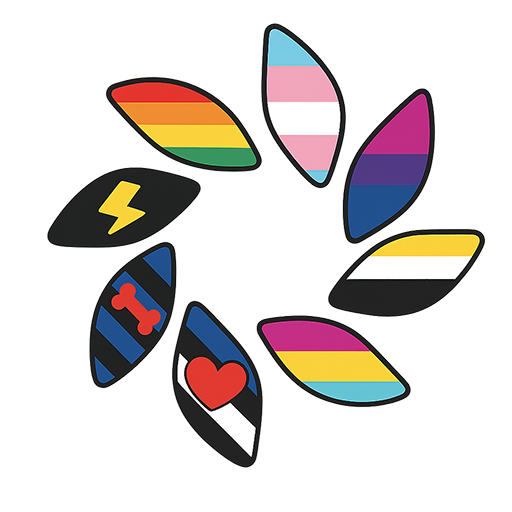

  

---

# Undefined

**Undefined** is a registered 501(c)(3) nonprofit organization dedicated to creating safe and affirming environments where LGBTQIA+ individuals facing marginalization can connect with others who understand their experiences.

## Our Mission

Our mission is to create safe and affirming environments where LGBTQIA+ individuals facing marginalization can connect with others who understand their experiences. We strive to build a strong sense of community through social gatherings, support groups, educational workshops, and advocacy initiatives. Our goal is to empower individuals to embrace their authentic selves, access vital resources, and thrive in a world that celebrates diversity and inclusion.

## What We Do

- **Community Events** - Social gatherings that foster connection and belonging
- **Support Groups** - Safe spaces for sharing experiences and building emotional wellness
- **Educational Workshops** - Programs that uplift, inform, and provide valuable resources
- **Advocacy Initiatives** - Efforts that challenge injustice and promote equity

## Organization Information

- **EIN:** 33-3432965
- **UBI:** 605 729 334
- **Status:** 501(c)(3) Nonprofit Organization
- **Founded:** February 2, 2025
- **Website:** [undefined.charity](https://undefined.charity)
- **Email:** [contact@undefined.charity](mailto:contact@undefined.charity)
- **Phone:** +1-206-580-4666

## Contact Information

**Mailing Address:**  
119 1st Ave NW #370  
Ephrata, WA 98823  
United States

**Service Address:**  
4301 Martin Rd  
Ephrata, WA 98823  
United States

## Transparency

We believe in complete transparency. You can view our official IRS documents and organizational files on our [Documents page](/documents) or in our public repository: [https://github.com/undefined-charity/undefined-site](https://github.com/undefined-charity/undefined-site)

## Website Development

This website is built using Astro JS, Tailwind CSS, and TypeScript to provide a fast, accessible, and modern web experience for our community.

## Development Instructions

1. Clone this repository to your local machine
2. Use Node 22: `nvm install 22` or `nvm use 22`
3. From the project directory, install Node dependencies: `npm install`
4. From the project directory, start development: `npm run dev`
5. See changes live at `http://localhost:4321`

## Contact

For website issues or suggestions, please contact us at [contact@undefined.charity](mailto:contact@undefined.charity)
